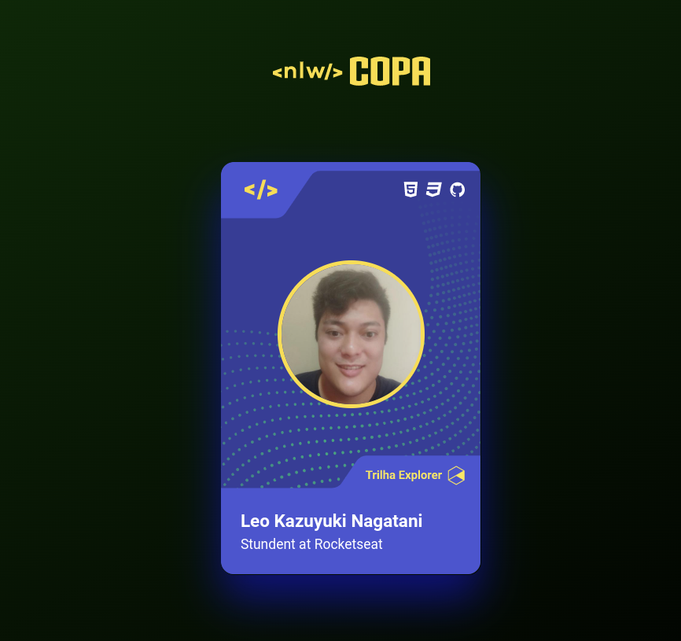

[Roadmap](#roadmap) |
[Documentação](#documentação) |
[Como Executar](#rodando-localmente) |
[Projeto](#stack-utilizada) |
[Next Level](#melhorias) 

# NLW Copa(Esquenta) - Crie uma figurinha da Copa - Frontend

- Nome do Evento: NLW Copa
- Data: De 31/10 a 04/11 de 2022
- Empresa: Rocketseat
- Evento ministrado por: Diego Schell Fernandes(Co-fundador e CTO na Rocketseat) e Rodrigo Gonçalves Santana(Educator na Rocketseat)
- Conteúdo: Construção de uma figurinha da Copa 

## Roadmap

- Criação do projeto com HTML, CSS, Javascript
- Configurações do projeto
- Importação dos cards do Figma

## Stack utilizada
HTML, CSS, Javascript

## Documentação
- Design no Figma disponível no link:  [NLW Copa - Figma](https://www.figma.com/file/X99xtDq4yknhoyeYeqkfHw/NLW-Copa-Card-(Copy)?node-id=0%3A1)

## Documentação de cores
- Colors no Figma disponível no link : [NLW eSports - Figma](https://www.figma.com/file/X99xtDq4yknhoyeYeqkfHw/NLW-Copa-Card-(Copy)?node-id=202%3A55)

## Melhorias

Que melhorias você fez no seu código? Ex: refatorações, melhorias de performance, acessibilidade, etc

## Aprendizados

O que você aprendeu construindo esse projeto? Quais desafios você enfrentou e como você superou-os?

## Suporte

Para suporte, mande um email para [leokazuyukinagatani@gmail.com](mailto:leokazuyukinagatani@gmail.com?subject=nlw-esports-frontend)

## Relacionados

Segue alguns projetos relacionados

